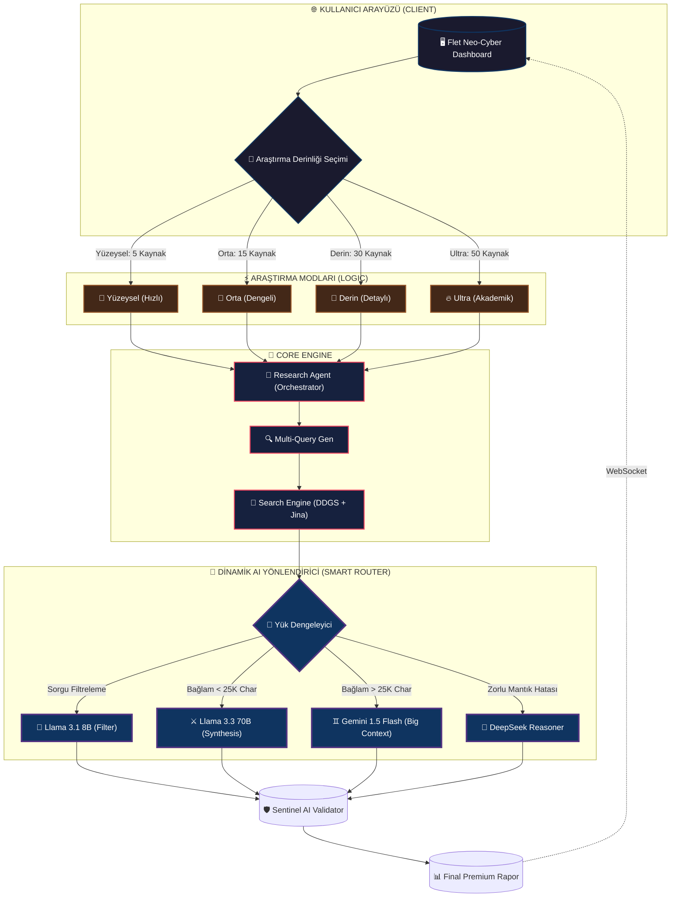

# 🌌 Nova Nexus Search: Hibrit AI Derin Araştırma Ekosistemi NOT: BU SİSTEM DEMO SÜRÜMÜDÜR HALA GELİŞTİRİLME AŞAMASINDADIR!!!

**Nova Nexus Search**, standart bir arama motoru değildir. İnternetin gürültüsünü temizleyen, ham veriyi akademik düzeyde analiz eden ve en gelişmiş yapay zeka modellerini bir "Orkestra Şefi" gibi yöneten **akıllı bir bilgi madenciliği istasyonudur.**


---

## 🏗️ Sistem Mimarisi ve Karar Mekanizması

Aşağıdaki şema, sistemin çok katmanlı yapısını ve bir sorgunun "Ham Veri"den "Doğrulanmış Rapor"a dönüşüm sürecini profesyonel bir hiyerarşiyle göstermektedir:



---

## 🌡️ Araştırma Derinliği Seviyeleri

Nova Nexus Search, ihtiyacınıza göre 4 farklı katmanda araştırma yürütebilir. Her katman, harcanan token ve taranan kaynak sayısına göre optimize edilmiştir:

| Mod | Kaynak Sayısı | AI Analiz Gücü | Kullanım Amacı | Hız |
| :--- | :---: | :--- | :--- | :---: |
| **🔹 Yüzeysel** | 5 | Llama 8B | Hızlı cevaplar, kısa tanımlar. | ⚡ Şimşek |
| **🔸 Orta** | 15 | Llama 70B | Genel konu araştırması, ödev hazırlığı. | 🏃 Hızlı |
| **💎 Derin** | 30 | Hybrid (70B & Gemini) | Teknik analiz, detaylı pazar araştırması. | 🧘 Sabırlı |
| **🔥 Ultra** | 50+ | Gemini & DeepSeek | Akademik makale, karşılaştırmalı tez çalışması. | 🐢 Kapsamlı |

---

## ⚡ Akıllı Hibrit Yönlendirme Özelliği

Sistemimiz, tek bir modele bağlı kalmaz. Girdiğiniz verinin boyutuna göre saniyeler içinde karar verir:
*   **Küçük Veri (< 25.000 Karakter):** Dünyanın en iyi denge modeli olan **Llama 3.3 70B**'yi (Groq) kullanır. Hatasız sentez yapar.
*   **Devasa Veri (> 25.000 Karakter):** Llama'nın limitlerini aştığımızda, 1 milyon token hafızalı **Gemini 1.5 Flash** bayrağı devralır. Hiçbir detayı atlamaz.
*   **Karmaşık Sorunlar:** Eğer prompt "Düşünme/Muhakeme" gerektiriyorsa **DeepSeek Reasoner** (Thinking Mode) devreye girerek adım adım mantık yürütür.

---

## 🛠️ Teknik Yetenekler (Packages & Core)

| Bileşen | Teknoloji | Fonksiyonu |
| :--- | :---: | :--- |
| **Backend** | `FastAPI` | Asenkron, yüksek hızda WebSocket ve REST API. |
| **Frontend** | `Flet (Flutter)` | Neon-Cyberpunk temalı, premium masaüstü/web GUI. |
| **Arama** | `DDGS / ddgs` | Reklam engellemeli, sansürsüz DuckDuckGo araması. |
| **Okuyucu** | `Jina Reader` | Web sayfalarını %95 doğrulukla saf metne dönüştürür. |
| **Logging** | `Loguru` | Gerçek zamanlı terminal takibi ve hata yönetimi. |
| **DB** | `SQLite / Alchemy` | Kullanıcı API anahtarları ve araştırma geçmişi arşivi. |

---

## 🚀 Kurulum Rehberi

### 1. Hazırlık
Python 3.12+ kurulu olmalıdır.
```bash
git clone https://github.com/nihai/nova-nexus-search.git
cd nova-nexus-search
```

### 2. Ortamı Kurma (Windows)
```bash
# Sanal ortam oluşturun
python -m venv proje
proje\Scripts\activate

# Bağımlılıkları yükleyin (Ultra Hızlı)
pip install -r requirements.txt
pip install ddgs -U
```

### 3. Yapılandırma
`.env` dosyanızı oluşturun ve anahtarlarınızı girin. Uygulama içindeki **Profil** sekmesinden de anahtarlarınızı canlı olarak güncelleyebilirsiniz.

### 4. Başlatma
```bash
python start.py
```

---

## 🛡️ Sentinel AI Doğrulama Sistemi
Oluşturulan her rapor, **Sentinel AI** adını verdiğimiz bir çapraz kontrol mekanizmasından geçer. Bu modül:
- Yazılan bilgilerin kaynaklarla çelişip çelişmediğini denetler.
- "Halüsinasyon" (AI uydurması) riskini analiz eder.
- Rapora 1-10 arası bir **Güvenilirlik Skoru** atayarak sizi yanıltıcı bilgilerden korur.

---
*Nova Nexus Search - Bilginin Sınırlarını Keşfedin.*
