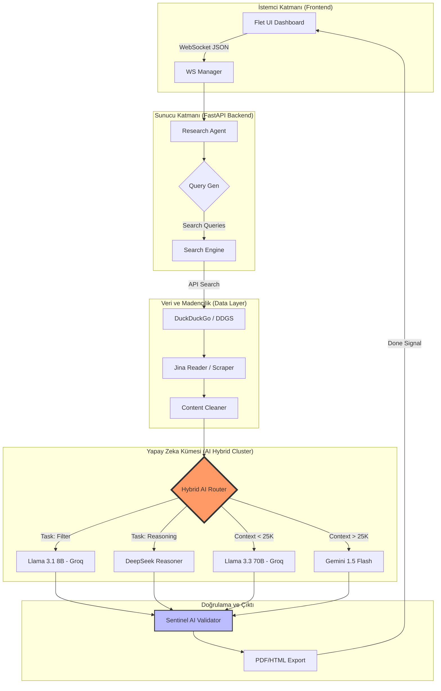

# 🌌 Nova Nexus Search: Hibrit AI Derin Araştırma Ekosistemi

**Nova Nexus Search**, klasik arama motorlarının ötesine geçerek interneti bir bilgi madeni gibi kazıyan, verileri doğrulayan ve en gelişmiş yapay zeka modelleriyle sentezleyen **yeni nesil bir hibrit araştırma motorudur.**


---

## 🏗️ Sistem Mimarisi ve Çalışma Şeması

Aşağıdaki şema, bir arama sorgusunun başlangıcından raporun kullanıcıya ulaştığı ana kadar izlediği yolu göstermektedir:



---

## 🔍 Bir Araştırma Nasıl Gerçekleşir? (Adım Adım)

1.  **Sorgu Analizi:** Kullanıcı arama yaptığında, sistem önce konuyu analiz eder ve en iyi sonuçları almak için 3-5 adet teknik alt sorgu üretir.
2.  **Bilgi Toplama:** DuckDuckGo üzerinden tüm dünya çapında tarama yapılır. Bulunan her URL, **Jina Reader** kullanılarak reklam/bannerlardan arındırılmış saf Markdown metnine dönüştürülür.
3.  **Hibrit Filtreleme (Hız):** Toplanan onlarca kaynak, **Llama 3.1 8B** (Groq) üzerinden saniyeler içinde taranır. Sadece konuyla en alakalı olan en iyi 15 kaynak seçilir.
4.  **Akıllı Yönlendirme (Router):** 
    *   Eğer toplam veri **25.000 karakterden az** ise **Llama 3.3 70B** kullanılır (Yüksek doğruluk).
    *   Eğer veri **25.000 karakterden fazla** ise devasa hafızasıyla **Gemini 1.5 Flash** devreye girer.
5.  **Doğrulama (Sentinel):** Yazılan rapor son bir kez "Çapraz Kontrole" girer. Yapay zeka kendi yazdığı rapordaki çelişkileri denetler ve bir **Güvenilirlik Skoru** üretir.
6.  **Arşivleme:** Tüm süreç `nova_nexus.db` (SQLite) veritabanına kaydedilir ve kullanıcıya anlık WebSocket üzerinden iletilir.

---

## 🛠️ Gerekli Paketler ve Teknoloji Yığını

Uygulamanın çalışması için aşağıdaki kritik kütüphaneler kullanılmaktadır:

| Paket | Görevi |
| :--- | :--- |
| **fastapi / uvicorn** | Yüksek performanslı asenkron API sunucusu ve WebSocket yönetimi. |
| **flet** | Flutter tabanlı, Python ile yazılmış modern ve dinamik kullanıcı arayüzü. |
| **ddgs (duckduckgo_search)** | Ücretsiz ve gizlilik odaklı web araması yapmayı sağlar. |
| **httpx** | Jina Reader ve diğer dış servislere asenkron HTTP istekleri atmak için. |
| **loguru** | Gelişmiş, renkli ve dosya tabanlı hata takip sistemi (Logging). |
| **sqlalchemy** | Veritabanı (SQLite) yönetimi ve ORM işlemleri. |
| **pydantic v2** | Veri tipi doğrulama ve JSON şemalarının yönetimi. |
| **groq / google-generativeai / openai** | AI modelleriyle iletişim kuran resmi SDK'lar. |

---

## 🚀 Kurulum ve Çalıştırma

### 1. Dosya Hazırlığı
Bilgisayarınızda Python 3.12 yüklü olduğundan emin olun.
```bash
git clone https://github.com/nihai/nova-nexus-search.git
cd nova-nexus-search
```

### 2. Bağımlılık Karargahı
```bash
# Sanal ortam oluşturma
python -m venv proje
source proje/bin/activate  # Windows: proje\Scripts\activate

# Paketleri yükleme
pip install -r requirements.txt
pip install ddgs -U  # Arama modülünü güncel tutun
```

### 3. Anahtar Yapılandırması (.env)
Aşağıdaki gibi bir `.env` dosyası oluşturun:
```env
JWT_SECRET=nexus_secret_key_123
DATABASE_URL=sqlite:///./nova_nexus.db
# API Anahtarlarınızı isterseniz buraya isterseniz uygulama içine girin
GROQ_API_KEY=your_key
GEMINI_API_KEY=your_key
DEEPSEEK_API_KEY=your_key
```

### 4. Ateşleme
```bash
python start.py
```

---

## 🛡️ Güvenlik ve Gizlilik
*   **Kişisel Anahtarlar:** API anahtarları veritabanında saklanır ancak her kullanıcı sadece kendi anahtarını kullanır.
*   **Oturum Güvenliği:** JWT tabanlı token sistemi ve 2FA (Çift Faktörlü Doğrulama) desteği altyapıda mevcuttur.

---
*Nova Nexus Search - Veriyi Bilgiye, Bilgiyi Güce Dönüştürün.*
