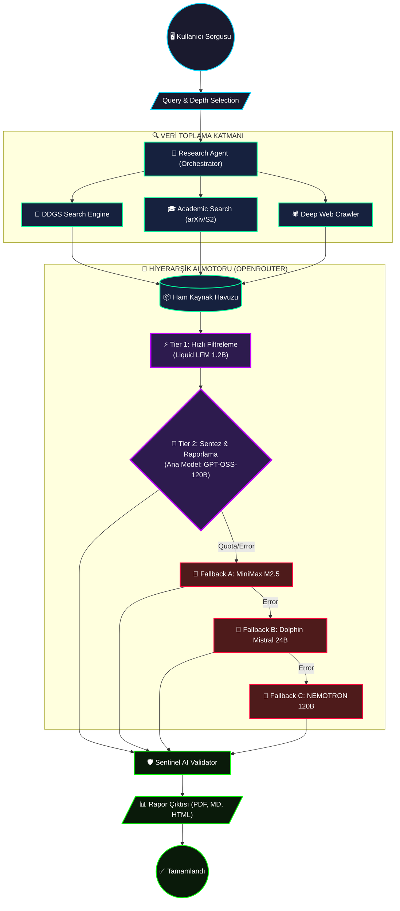

# 🌌 Nova Nexus Search: Pro Research Ecosystem
## *Beyond Search, Into Intelligence.*

**Nova Nexus Search**, standart bir arama motoru değildir. İnternetin gürültüsünü temizleyen, ham veriyi akademik düzeyde analiz eden ve en gelişmiş **OpenRouter** yapay zeka modellerini bir "Orkestra Şefi" gibi yöneten, tamamen **ücretsiz modeller üzerine inşa edilmiş profesyonel bir bilgi madenciliği istasyonudur.**

<div align="center">


</div>

---

> [!CAUTION]
> ### ⚠️ KRİTİK UYARI / DISCLAIMER (ÖNEMLİ)
> 
> **🧪 Erken Test Aşamasında (Alpha/Beta):** Bu sistem aktif geliştirme ve test aşamasındadır. Kapsamlı bir "Hata (Bug)" barındırma ihtimali yüksektir. Sistem, zaman zaman beklemeyen çökmeler yaşayabilir.
>
> **🌍 Dil Desteği Sınırlaması:** Sistem altyapı olarak **12 dil desteğine** (Promptlar, yerelleştirmeler ve çeviriler) sahip olmakla birlikte, aktif olarak sadece **Türkçe ve İngilizce** dillerinde detaylıca test edilmiştir. Diğer dillerde kullanırken ekstra hatalar veya dil kaymaları gözlemleyebilirsiniz NOT: TÜRKÇE DİLİNDE KAYMALAR VE BOZUKLUKLAR VARDIR BİLGİNİZE!!!!.
> 
> **🧠 Halüsinasyon Riski:** Yapay zeka ajanları, nadiren de olsa veriler arasında yanlış bağlantılar kurabilir veya "Halüsinasyon" (gerçek dışı bilgi üretimi) yaşayabilir. **Sentinel AI** doğrulama sistemimiz bu riski minimize etse de, rapor edilen bilgileri kritik işlerinizde her zaman manuel olarak çapraz kontrolden geçirmeniz **hayati önem taşır.**

---

---

## 🐞 Bilinen Hatalar & Eksiklikler (Known Bugs & Issues)

- Ara yüz güncellemelerinde bazen beklenmeyen çökmeler yaşanabiliyor.
- Türkçe ve diğer bazı dillerde zaman zaman çeviri/dil kaymaları ve lokalizasyon sorunları mevcut.
- Offline mod ve multi-user desteği tamamen stabilize değil.
- Derin arama (deep/ultra) modunda, nadiren beklenmedik model hataları alabilirsiniz (API sınırları/fallback tetikleniyor).
- UI-klasöründeki bazı butonlar ve simgeler bazı sistemlerde gözükmeyebilir.
- Sentinel AI "Güvenilirlik Skoru" algoritması gelişime açıktır ve yanlış/eksik puanlama verebilir.
- Kod ve kullanıcı dokümantasyonu eksik/İngilizce/Türkçe karışık.

> [ ] Lütfen yeni keşfettiğiniz hataları **GitHub Issues** üzerinden bildiriniz!

---

## 🤝 Katkı Sağlamak (Contributing)

Her türlü katkıyı memnuniyetle karşılıyorum!

- Kod katkısı yapmak için:
  - Fork'la, yeni bir dalda (branch) çalış, Pull Request (PR) gönder.
- Hataları (bug) veya geliştirme önerilerini:
  - GitHub Issues üzerinden yazabilirsin.
- Dokümantasyon katkısı, çeviri ve UI iyileştirmeleri de çok önemli!
- Yardımcı olmak, sorular veya öneriler için Tartışmalar (Discussions) kısmını kullanabilirsin.

> Not: Kodda veya README'de hata bulursan, doğrudan düzelt ve PR açabilirsin. Katkı yapan herkes README'de listelenecek!

---

## 🗺️ Yol Haritası (Roadmap)

### v2.x - Mevcut 
- [x] OpenRouter destekli hibrit arama ve raporlama
- [x] PDF, HTML, Markdown, JSON dışa aktarım
- [x] Çoklu dil desteği (TR/EN testli)
- [x] Deep Crawler ve Sentinal AI entegre
- [x] Fallback sistemli model mimarisi

### v2.2 - Hedeflenenler
- [ ] Offline (tamamen local) mod
- [ ] Session tabanlı ve kullanıcıya özel arama geçmişi
- [ ] UI iyileştirmeleri & daha modern tema seçenekleri
- [ ] Yorum/Sonuç karşılaştırma modülü
- [ ] Geliştirici ve API dökümantasyonunun tamamlanması
- [ ] Yeni modellerle/anlık güncelleme desteği
- [ ] Topluluk çevirileri ve yeni diller

---

## 📢 Destek & İletişim

Her türlü soru, katkı veya öneri için GitHub Issues & Discussions bölümlerini kullanabilirsin veya direkt bana buradan ulaşabilirsin.

---

## 🏗️ Mimari Akış: Bilginin Dönüşümü

Aşağıdaki şemada, bir sorgunun ham internet verisinden rafine bir akademik rapora nasıl dönüştüğü ve **OpenRouter Fallback** sisteminin nasıl çalıştığı gösterilmektedir:



---

## 💎 Temel Özellikler

- **🎭 Hibrit Zeka**: OpenRouter üzerindeki en iyi ücretsiz modelleri görev bazlı (Filtreleme, Sentez, Denetleme) kullanır.
- **🛡️ Sentinel AI**: Üretilen her raporu kaynaklarla karşılaştırarak doğruluk skorunu hesaplar.
- **🕷️ Deep Crawler**: Sadece meta veriyi değil, Jina Reader ile sayfaların içeriğini tam metin olarak okur.
- **🎓 Akademik Derinlik**: arXiv ve Semantic Scholar entegrasyonu ile magazin haberlerini bilimsel gerçeklerden ayırır.
- **📄 Çoklu Format**: Raporlarınızı anında **PDF**, **Markdown**, **HTML** veya **JSON** olarak dışa aktarın.
- **🎨 Neo-Cyberpunk UI**: MacOS ve Windows 11 estetiğinden ilham alan, cam efekti (Glassmorphism) odaklı modern arayüz.

---

## ⚡ AI Model Hiyerarşisi (Tier Strategy)

| Aşama | Birincil Model (Primary) | Yedekler (Fallbacks) | Neden Bu Model? |
| :--- | :--- | :--- | :--- |
| **🔍 Filtreleme** | `liquid/lfm-2.5-1.2b:free` | `gpt-oss-120b` | İnanılmaz hız (156 t/s) ve temiz eleme. |
| **📊 Sentezleme** | `openai/gpt-oss-120b:free` | `minimax-m2.5`, `dolphin-mistral` | 131K Context ve 120B parametre ile derin bilgi. |
| **🛡️ Doğrulama** | `openai/gpt-oss-120b:free` | `nemotron-a12b` | Kaynaklar arası çelişkileri bulmada rakipsiz. |

---

## 🛠️ Teknik Kurulum (Developer Guide)

### 1️⃣ Ön Hazırlık
Sistem için **Python 3.12+** ve terminal erişimi gereklidir.

```bash
# Repo'yu klonlayın
git clone https://github.com/nihai/nova-nexus-search.git
cd nova-nexus-search
```

### 2️⃣ Sanal Ortam Oluşturma
Bağımlılıkların temiz kalması için sanal ortam şarttır:
```bash
python -m venv proje
# Windows:
proje\Scripts\activate
# Linux/Mac:
source proje/bin/activate
```

### 3️⃣ Bağımlılık Enjeksiyonu
```bash
pip install -r requirements.txt
# PDF motoru için (xhtml2pdf)
pip install xhtml2pdf -U
```

### 4️⃣ Yapılandırma (\`.env\`)
Ana dizinde `.env` dosyası oluşturun ve şu değerleri girin:
```env
# OpenRouter API (https://openrouter.ai/)
OPENROUTER_API_KEY=sk-or-v1-SİZİN_ANAHTARINIZ

# Güvenlik (JWT Secret)
SECRET_KEY=nova_nexus_secret_hash_value_99
```

---

## 🖥️ Kullanım Senaryosu

1. **Başlat**: `python start.py` komutunu çalıştırın.
2. **Kayıt**: E-posta ve şifrenizle yerel profilinizi oluşturun.
3. **Araştır**: Bir konu yazın (Örn: "Kuantum Bilgisayarların Geleceği"), derinlik seçin (Ultra Mod tavsiye edilir) ve **Nova Nexus**'un interneti taramasını izleyin.
4. **Analiz**: Rapor bittiğinde "Güvenilirlik Skoru"na bakın. Eğer skor 8 altındaysa, "Desteksiz İddialar" kutusundaki uyarıları okuyun.
5. **Sakla**: Sağ alttaki "PDF İndir" butonuna basarak raporu arşivleyin.

---

> [!IMPORTANT]
> **Geliştirici Notu:** Bu proje ticari bir ürün değildir. Yapay zeka teknolojilerinin araştırma süreçlerini ne kadar hızlandırabileceğini kanıtlamak amacıyla geliştirilmiş bir **PoC (Proof of Concept)** çalışmasıdır.

---
*Nova Nexus Search - Bilginin Sınırlarını Keşfedin.*
